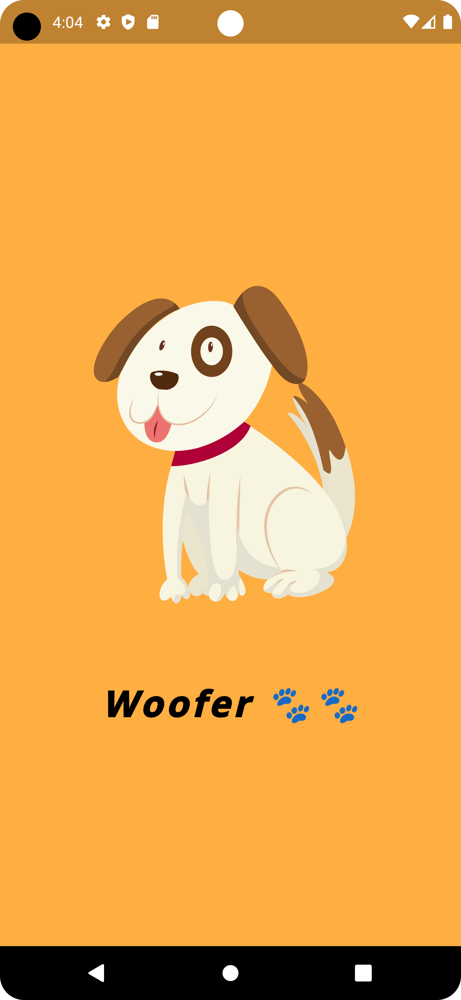
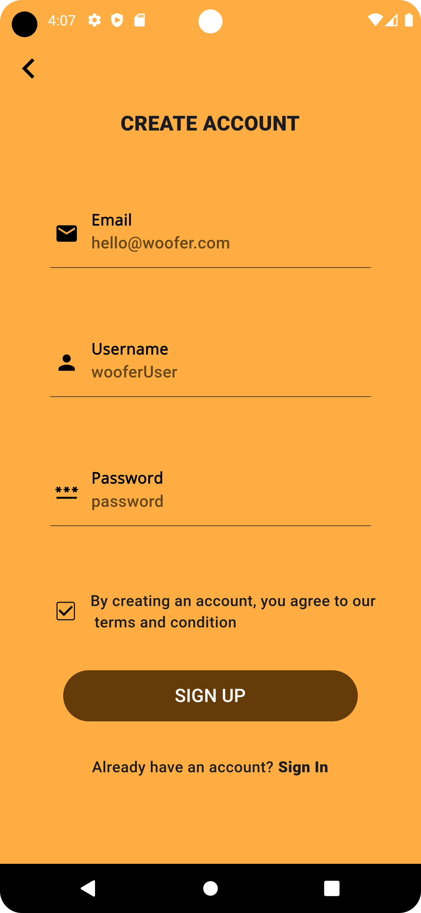

# Woofer Flutter App

## Description
Woofer is a Flutter app designed to help dog owners find a wide range of services for their furry companions. Whether you're looking for a vet, a dog walker, grooming services, or more, Woofer has got you covered. This app aims to make it easier for pet owners to connect with service providers, ensuring the well-being and happiness of their beloved dogs.

## Image Gallery
<table>
  <tr>
    <td>
      
    </td>
    <td>
      
    </td>
  </tr>
  <tr>
    <td>
      
    </td>
    <td>
      
    </td>
  </tr>
  <tr>
    <td>
      
    </td>
    <td>
      
    </td>
  </tr>
</table>

## Getting Started
Before you can start using Woofer, you'll need to set up your development environment and install the necessary dependencies. Here are the steps to get started:

### Prerequisites
- Flutter SDK (Version >= 3.1.2 < 4.0.0)
- Android Studio or Visual Studio Code with Flutter and Dart plugins
- Emulator or physical device for testing

### Installation
1. Clone the Woofer repository from GitHub.
   ```bash
   git clone https://github.dev/Njuguna-JohnBrian/Woofer
   ```

2. Navigate to the project directory.
   ```bash
   cd woofer
   ```

3. Install the required dependencies.
   ```bash
   flutter pub get
   ```

4. Launch the app on your preferred development environment.
   ```bash
   flutter run
   ```

## Dependencies
Woofer relies on several Flutter packages to provide a seamless user experience. Here's a list of the main dependencies used in this app:

- `cupertino_icons` (Version ^1.0.2): Provides Cupertino (iOS-style) icons for the app.
- `flutter_native_splash` (Version ^2.3.2): Generates native splash screens for the app.
- `google_fonts` (Version ^6.1.0): Allows the use of Google Fonts for text in the app.
- `lottie` (Version ^2.6.0): Integrates Lottie animations into the app for a rich visual experience.
- `smooth_page_indicator` (Version ^1.1.0): Provides smooth page indicators for swiping through content.
- `flutter_svg` (Version ^2.0.7): Enables the use of SVG images in the app.

## Development Tools
- Flutter Test: The Flutter test package (included in dev_dependencies) allows you to write and run tests for your app to ensure its functionality.

## Flutter Configuration
The Flutter configuration in the `pubspec.yaml` file includes specifying the assets used in the app. Assets can be found in the `assets/`, `assets/animations/`, and `assets/images/` directories.

```yaml
flutter:
  uses-material-design: true
  assets:
    - assets/
    - assets/animations/
    - assets/images/
```

## Contribute
We welcome contributions from the open-source community to help improve Woofer. If you'd like to contribute to the project, please fork the repository, make your changes, and submit a pull request.

## License
This project is licensed under the [MIT License](LICENSE). You are free to use, modify, and distribute this software, subject to the terms of the license.

Thank you for using Woofer! We hope this app makes it easier for you to find the best services for your furry friends. If you have any questions or encounter any issues, please don't hesitate to contact us.